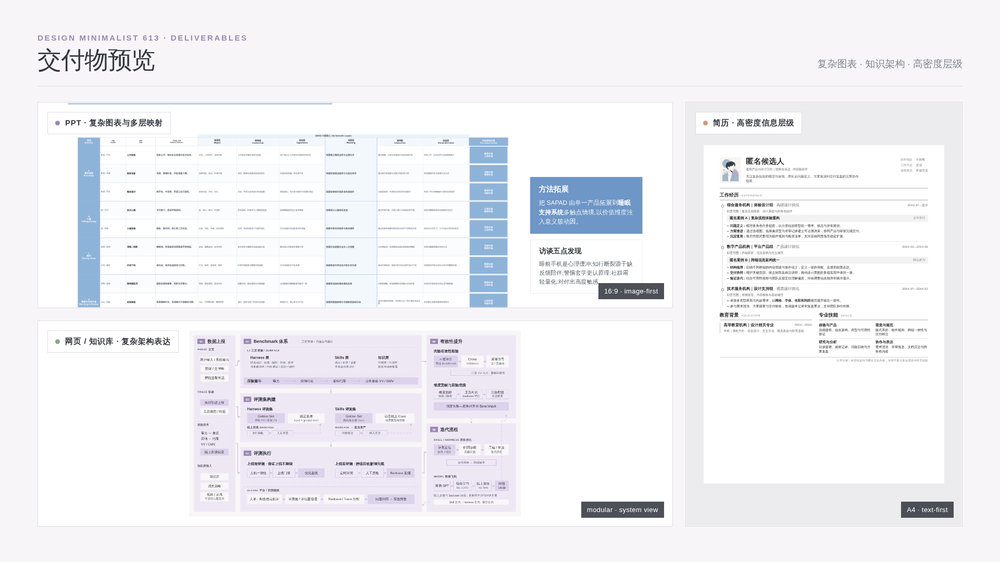
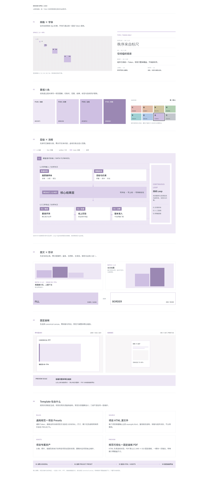

# Design Minimalist 613

> 一套让设计规则稳定、让项目经验持续增长的极简设计 Skill。

**当前阶段：Private Draft。** 先在 GitHub 私有仓库中完成检查与定稿，再切换为公开仓库。

## 它有什么效果

Design Minimalist 613 把同一套视觉语言应用到不同媒介：固定画板、4px 网格、统一字体 Token、雾感色板与视觉量感规则共同保证输出稳定；项目 preset 再决定当前任务是图片优先、文本优先还是平衡布局。

- **研究型演示**：固定 `1440×810 / 16:9`，一页一个结论，图片或结构图占主体 60–75%。
- **极简简历**：固定 `595×837 / A4`，文本优先，层级、分割线与分页由同一组 Token 约束。
- **网页、PDF 与海报**：浏览可以适配容器，但导出前必须回到 canonical canvas，避免随机断页与版式漂移。

## 交付物预览

Skill 不只保存抽象规范，也保存已脱敏的项目 preset、源实例和资产，让 Agent 能先看到“完成后的样子”，再复用结构生成新内容。

- **PPT 复杂图表**：展示多层信息、数据图表、用户旅程与结论页的组织能力。
- **网页 / 知识库预览**：展示复杂架构、图文组合与跨模块视觉一致性。
- **简历复杂层级**：展示高密度文本、标题层级、日期轴、分割线和固定阅读轴。



| 预览类型 | 媒介策略 | 可复用参考 |
|---|---|---|
| PPT 复杂图表 | 16:9、图片优先、一页一结论 | `preset.yaml`、匿名 `example.html`、21 页脱敏源 HTML |
| 简历复杂层级 | A4、文本优先、固定阅读轴 | `preset.yaml`、匿名 `example.html`、canvas contract、抽象头像 |
| 网页 / 知识库 | 连续浏览、模块化呈现 | 设计规范源 HTML、结构图与固定画板导出方法 |

项目文件位于 `design-minimalist-613/assets/template/projects/`。其中的 HTML 是结构参考，不是需要照搬的内容模板；README 只展示经过脱敏的截图。

## 为什么要这样写



我的设计哲学不是“把风格写成更多规则”，而是把稳定与变化分开：

1. **规则稳定**：网格、字体、色板、视觉量感和固定画板构成通用层。
2. **项目增长**：每次被确认可复用的交付，先沉淀为项目 preset、匿名源实例和特殊资产。
3. **谨慎晋升**：同一做法至少跨两个项目稳定复用后，才建议进入通用层。

这能避免两种常见问题：只有规范、没有真实交付物，导致 Agent 不知道如何落地；或者不断把项目例外写进总规则，最终让规范失去边界。

## HTML 如何长期保存

PDF 和截图只作为预览，不作为源文件。长期保存采用以下方式：

1. **Git 保存源码**：把 HTML、CSS、JS、图片和字体一起提交，而不是依赖临时预览链接。
2. **依赖相对路径**：资源放在同一项目目录或直接内联，避免外部 CDN、临时域名和绝对本地路径。
3. **源文件与预览分离**：源 HTML 负责继续编辑；PNG/PDF 负责快速查看和版本对比。
4. **静态托管可替换**：私有阶段直接从仓库下载后打开；公开后可选 GitHub Pages 或其他静态托管，源文件仍以 Git 版本为准。

当前已归档：

- [设计规范源 HTML](design-minimalist-613/assets/template/design-spec/index.html)
- [21 页脱敏研究型演示源 HTML](design-minimalist-613/assets/template/projects/ppt-research/source-example.html)
- [脱敏 A4 简历源 HTML](design-minimalist-613/assets/template/projects/resume-minimal/example.html)

因此不需要从 PDF 反向还原 HTML，也不会把线上预览地址当作唯一存档。

## Skill 结构

```text
Design_minimalist_613/
├── README.md
├── readme-assets/                  # README 展示图，不参与 Skill 运行
└── design-minimalist-613/          # 标准 Skill 目录
    ├── SKILL.md
    ├── .skillignore
    ├── references/
    │   ├── GENERAL.md
    │   ├── PROJECTS.md
    │   └── project-registry.json
    ├── scripts/
    │   └── update_project_catalog.py
    └── assets/template/
        ├── design-spec/            # HTML + CSS + JS + 本地资产
        └── projects/
            ├── ppt-research/
            └── resume-minimal/
```

`readme-assets/` 只是一个普通文件夹，用来存放 GitHub README 中显示的截图与组合预览；它替代了含义较泛的 `docs/`，删掉不会影响 Skill 运行。

`SKILL.md` 的 `name` 必须使用小写字母、数字和连字符，并与技能目录名一致。因此仓库展示名可以是 **Design Minimalist 613**，标准技能目录使用 `design-minimalist-613`。

## 使用方式

将 `design-minimalist-613/` 作为完整 Skill 目录安装到支持 Agent Skills 的客户端。触发示例：

- “按 Design Minimalist 613 的规范做一份研究型演示”
- “用现有 resume preset 生成一页 A4 简历”
- “把这次确认的海报方案沉淀进项目库”

新增项目时运行：

```bash
cd design-minimalist-613
python3 scripts/update_project_catalog.py \
  --slug <project-slug> \
  --title "<项目类型>" \
  --canvas "<宽x高 / 比例>" \
  --priority image-first|text-first|balanced \
  --summary "<已泛化的可复用方法>"
```

## 发布格式

本仓库采用开放的 [Agent Skills 目录规范](https://agentskills.io/specification)：每个技能目录至少包含一个带 YAML frontmatter 的 `SKILL.md`，并可按需加入 `scripts/`、`references/` 与 `assets/`。上传 GitHub 时保留完整目录结构，而不是只上传 `SKILL.md`。

## 隐私说明

私有版本也按未来公开标准处理：姓名、联系方式、学校、公司、真实项目名称与可识别业务数据均删除或替换；示例图像使用匿名插画或泛化内容。新增项目进入仓库前，也应先完成同等级别的脱敏。
