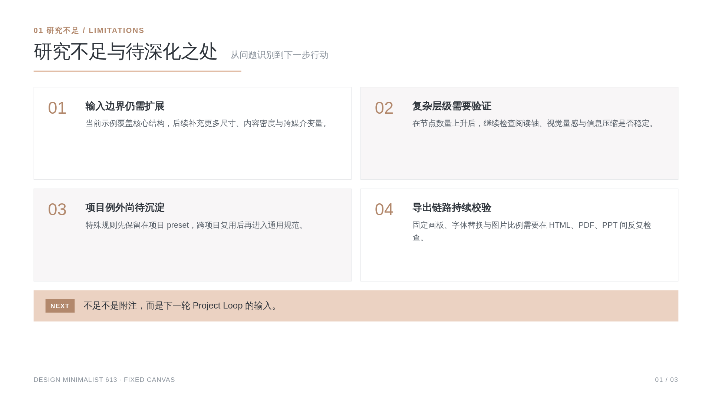
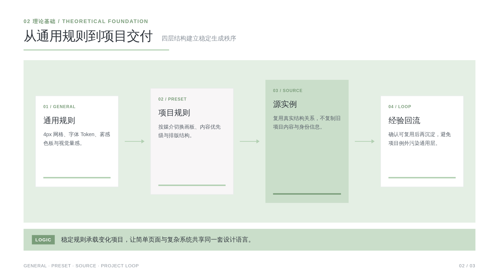
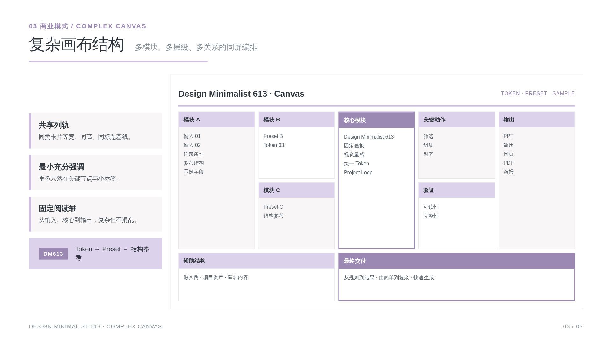
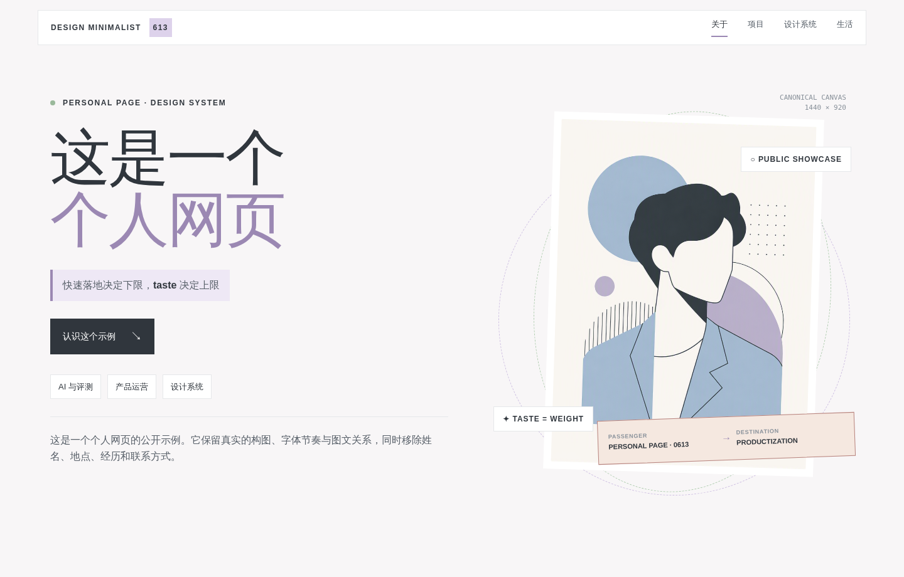
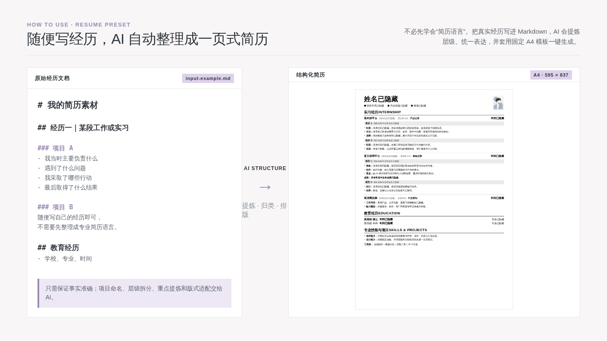
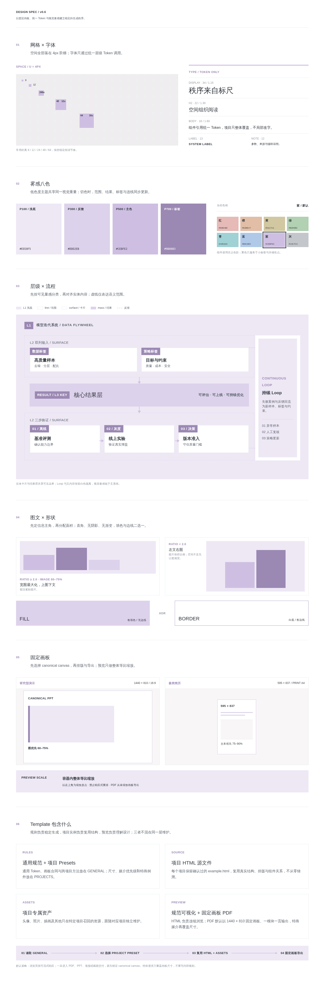

# Design Minimalist 613

> 把设计从一次性的“做得好看”，变成一套能够持续复用、验证和生长的生成系统。

## 它能带来什么：由简单到复杂，快速生成

### 规范设计->稳定生成、Html->快速落地

Design Minimalist 613 的核心不是复刻某一种视觉风格，而是先把**网格、字体、颜色、视觉量感和画板**这些稳定因素固定下来，再让项目 preset 决定当前场景应该怎样变化。同时有一定的Loop机制，希望能帮大家快速完成85分的工作！

- **通用规则保持稳定**：4px 网格、统一字体 Token、雾感色板与视觉量感建立一致的设计底座。
- **项目经验持续增长**：每个项目都保留脱敏后的 preset、HTML 源实例和专属资产，让 Agent 先看到“完成后的样子”，再生成新内容。
- **交付结果可以回流**：被确认可复用的做法先沉淀在项目层；只有跨项目稳定后，才进入通用层。

这套方法可以从一张简单信息页，扩展到复杂流程图、研究型演示、高密度简历、个人网页、PDF、海报与结构化视觉稿。重点不是让所有媒介长得一样，而是让它们共享同一套秩序。

### 不同场景，需要切换不同优先级

| 场景 | 主要注意点 | 推荐策略 |
|---|---|---|
| 研究型演示 / PPT | 信息多，但每页仍需只有一个结论 | 固定 `1440×810 / 16:9`；图或结构占主体 60–75% |
| 极简简历 | 字体细、密度高，最怕缩放后失真 | 固定 `595×837 / A4`；文本优先，保持阅读轴与层级 Token |
| 网页 / 知识库 | 需要连续浏览，也需要形成稳定截图 | 浏览时允许适配；导出时回到 canonical canvas |
| PDF / 海报 | 最容易出现随机断页和大面积留白 | 一模块或一结论一页，从未缩放画板导出 |
| 复杂流程图 | 节点、连线、范围框会同时争夺注意力 | 先分 `mass / surface / line / text`，再按视觉量感对齐 |

### 调试时踩过的坑

1. **流式网页直接打印**：浏览器会随机分页，造成断页与留白；解决方式是先锁定固定画板。
2. **只靠 `object-fit` 防变形**：图片虽然没被裁切，但面积可能完全不合理；应先确定图文主次，再决定比例。
3. **所有强调都使用重色**：页面很快失去层级；重色只用于小标签、关键数字和极少量焦点。
4. **把虚线框当作主对齐边界**：几何上整齐，视觉上却漂移；实体内容应优先对齐同量感对象。
5. **把项目例外直接写进总规范**：规则会越来越臃肿；先进入项目 preset，跨项目验证后再晋升。
6. **只保存线上预览地址**：链接失效后无法继续编辑；HTML、CSS、JS 与本地资产必须一起进入 Git。
7. **只替换姓名，不检查图片与源文件**：截图看似匿名，源码仍可能泄露信息；源 HTML、图片、元数据和 README 预览都要分别检查。

## 交付物预览
展示用的平方PingFang SC-regular，当然针对各个系统有做字体兜底，平方转化成图片会横向变细一点，PDF/JPG建议字体降级，用html展示无需改动，只会比下列参考更美丽。

### PPT｜由简单到复杂，快速生成

**01 研究不足｜四项待深化问题**



**02 理论基础｜理论演变谱系**



**03 商业模式｜复杂画布结构**



### 网页｜匿名首图结构与图文编排

垫了@四四（红薯号）的人物图作为生成，请勿商用。



### 简历｜怎么使用

随便写下自己的经历即可，不必先整理成专业简历语言。AI 会把自然语言转化为有层级的结构化文档，再套用固定 A4 模板一键生成简历。下图左侧是 Markdown 经历切片，右侧是生成后的完整简历。



## 为什么要这样写

设计哲学不是一条孤立规则，而是一套从基础标尺到复用机制的完整系统：

1. **网格 × 字体**：用 4px 阶梯和统一字体 Token 建立稳定节奏。
2. **OKLCH管理色彩关系**：让不同主题色拥有接近的视觉重量，而不是随意猜色。
3. **层级 × 流程**：先判断可见量感，再对齐实体内容、结果层与反馈关系。
4. **图文 × 形状**：先定信息主角，再分配面积；填色与边线只选一种表达。
5. **固定画板**：设计、预览与导出共享 canonical canvas，避免响应式重排破坏版式。
6. **模板分层**：通用规则、项目 preset、源实例、项目资产各自维护，避免互相污染。



这套分层解决了两个常见问题：只有规范、没有真实交付物时，Agent 不知道怎样落地；不断把项目例外写进总规则时，规范又会逐渐失去边界。

## HTML 如何长期保存

PDF 和截图只负责预览，不作为源文件。长期保存采用以下方式：

1. **Git 保存源码**：HTML、CSS、JS、图片和字体一起提交，不依赖临时预览链接。
2. **依赖相对路径**：资源跟随项目目录保存，避免临时域名和绝对本地路径失效。
3. **源文件与预览分离**：源 HTML 负责继续编辑；PNG/PDF 负责快速查看与版本对比。
4. **静态托管可替换**：仓库始终是源文件基线，GitHub Pages 或其他托管只承担访问入口。

代码里的 `data:image/png;base64,...` 是把图片直接编码进 HTML 的 **Data URI**，不是乱码。它适合需要单文件离线携带的页面；需要频繁复用的图片则放进 `assets/` 并使用相对路径，便于维护和查看 Git diff。

已归档源文件：

- [完整设计规范 HTML](design-minimalist-613/assets/template/design-spec/index.html)
- [三页 PPT 展示实例](design-minimalist-613/assets/template/projects/ppt-research/example.html)
- [匿名个人网页源 HTML](design-minimalist-613/assets/template/projects/personal-web/example.html)
- [A4 简历源 HTML](design-minimalist-613/assets/template/projects/resume-minimal/example.html)
- [简历使用方式合图源 HTML](design-minimalist-613/assets/template/projects/resume-minimal/how-to-use.html)
- [Markdown 经历输入示例](design-minimalist-613/assets/template/projects/resume-minimal/input-example.md)

## Skill 结构

```text
Design_minimalist_613/
├── README.md
├── readme-assets/                  # GitHub README 展示图
└── design-minimalist-613/          # 标准 Skill 目录
    ├── SKILL.md
    ├── .skillignore
    ├── references/
    │   ├── GENERAL.md
    │   ├── PROJECTS.md
    │   └── project-registry.json
    ├── scripts/
    │   └── update_project_catalog.py
    └── assets/template/
        ├── design-spec/            # HTML + CSS + JS + 本地资产
        └── projects/
            ├── ppt-research/
            ├── personal-web/
            └── resume-minimal/
```

`readme-assets/` 只存放 GitHub README 的截图与预览，不参与 Skill 运行。仓库展示名可以使用 **Design Minimalist 613**；标准 Skill 目录与 `SKILL.md` 中的 `name` 必须使用小写、数字和连字符，因此写作 `design-minimalist-613`。

## 使用方式

将 `design-minimalist-613/` 作为完整 Skill 目录安装到支持 Agent Skills 的客户端。触发示例：

- “按 Design Minimalist 613 的规范做一份研究型演示”
- “用现有 resume preset 生成一页 A4 简历”
- “基于个人网页示例做一张多色作品页”
- “把这次确认的海报方案沉淀进项目库”

新增项目时运行：

```bash
cd design-minimalist-613
python3 scripts/update_project_catalog.py \
  --slug <project-slug> \
  --title "<项目类型>" \
  --canvas "<宽x高 / 比例>" \
  --priority image-first|text-first|balanced \
  --summary "<已泛化的可复用方法>"
```

## 发布格式

本仓库采用开放的 [Agent Skills 目录规范](https://agentskills.io/specification)：每个技能目录至少包含一个带 YAML frontmatter 的 `SKILL.md`，并可按需加入 `scripts/`、`references/` 与 `assets/`。上传 GitHub 时保留完整目录结构，而不是只上传 `SKILL.md`。

## 隐私说明

所有示例均按公开发布标准处理：姓名、联系方式、学校、公司、真实项目名称、日期与可识别业务数据均删除或替换；人物图像使用匿名插画。新增项目进入仓库前，也应完成同等级别的源文件与预览图检查。
